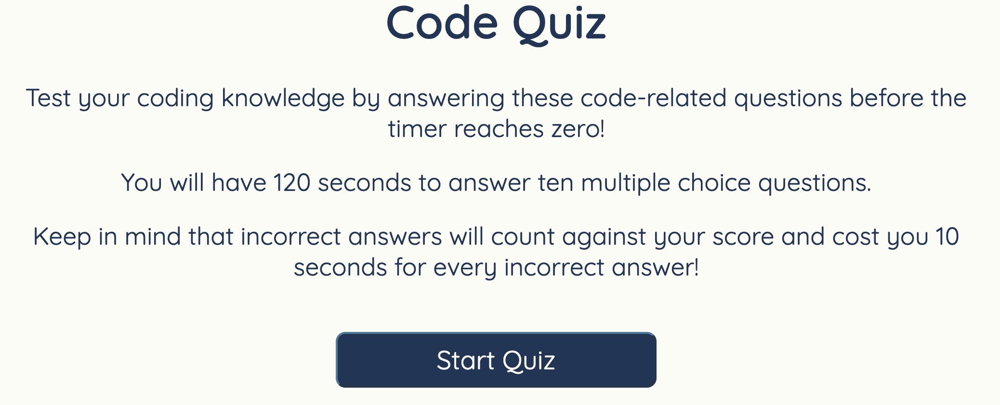
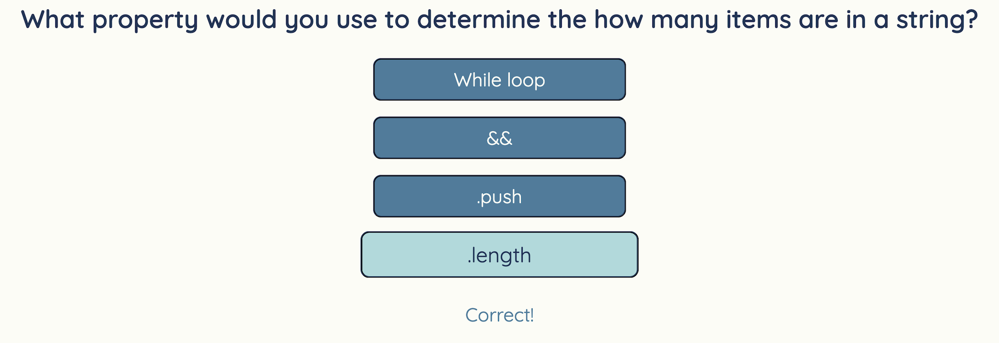
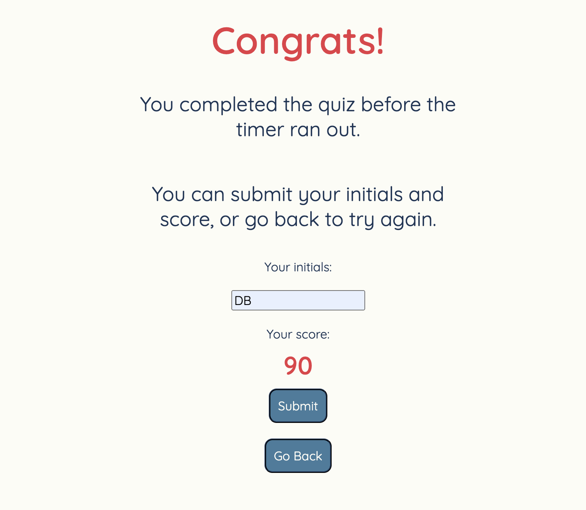
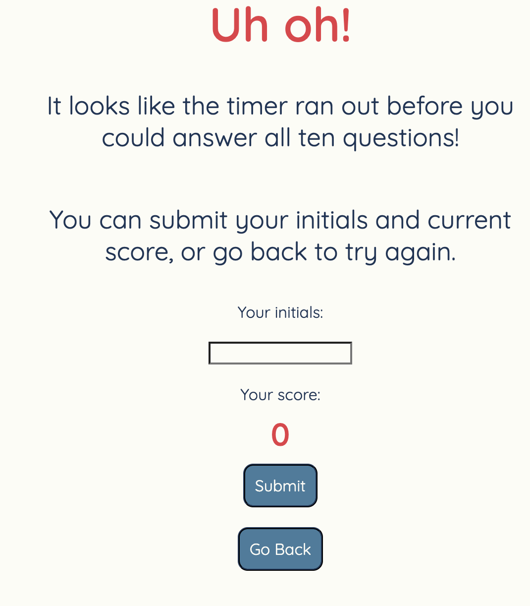
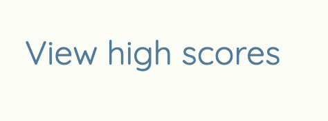
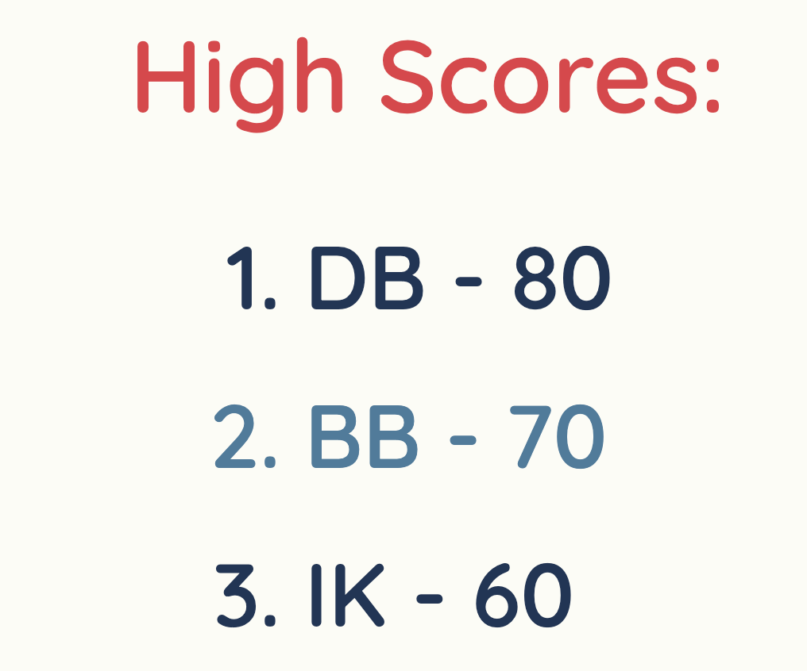

# JavaScript Quiz

## Description
The purpose of this project was to create a basic quiz using JavaScript to render the quiz questions and answer choices on the screen and recording the users answers as the quiz progresses. The quiz includes a timer functionality, feedback on answer choices, and a save high score option as well as a page to view and compare past saved high scores. The most difficult aspects of this project for me were the functions to randomly display questions without having repeat questions, and the functions to judge if the question the user selected were correct or incorrect. Both of these functionalities were achieved using arrow function expressions, and the .forEach() method, which executes a function for each element in an array. Both of these were foreign concepts for me at the beginning of this project that I learned to create this project.

## Installation

No Installation is necessary to use this application. The deployed page can be accessed at https://boushka9.github.io/tiny-lego-parakeet/ .

## Usage

Access the deployed project at  https://boushka9.github.io/tiny-lego-parakeet/ .

When the homepage loads, you will see the instructions for the quiz beneath the title 'Code Quiz', as well as a start button. On the top left of the page there is a link to view the saved high score and initials pairs. At the top right of the page there is a timer of 120 seconds.

As the instructions on the homepage state, there are ten coding related questions to be completed in under 120 seconds. Each correct question is worth ten points towards your score, while each incorrect question will deduct 10 seconds from the timer. Press the start button to begin the quiz.

Once you press start, the timer will begin counting down, and you will see a question along with four answer options appear on the screen.

If you answer the question correctly, a light blue 'Correct!' will appear beneath the questions.

If your answer is incorrect, a red 'Wrong!' will appear instead.

If you answer all the questions before the timer runs out, you will see the 'Congrats!' page.

If the timer reaches zero before you finish answering all of the questions, you will see the 'Uh-Oh!' page.

Both end pages will give you the option of saving your initials and score, and/or returning to the homepage to try the quiz over again.

Once you have played a couple of rounds and saved your scores, you can access the list of saved high scores. To do so, click on the link at the top left corner of the screen. This will take you to the high scores page which will list out a ranking of the scores from highest to lowest. To return to the homepage, press 'Go Back' at the top left corner of the screen. 

## Credits

The following tutorials by James Q. Quick (his Youtube Channel is https://www.youtube.com/@JamesQQuick) were used throughout this project as general guides and to deepen my understanding of the JavaScript used to complete this project.

https://www.youtube.com/watch?v=zZdQGs62cR8

https://www.youtube.com/watch?v=DFhmNLKwwGw

https://www.youtube.com/watch?v=jfOv18lCMmw&ab_channel=JamesQQuick

## License

MIT

